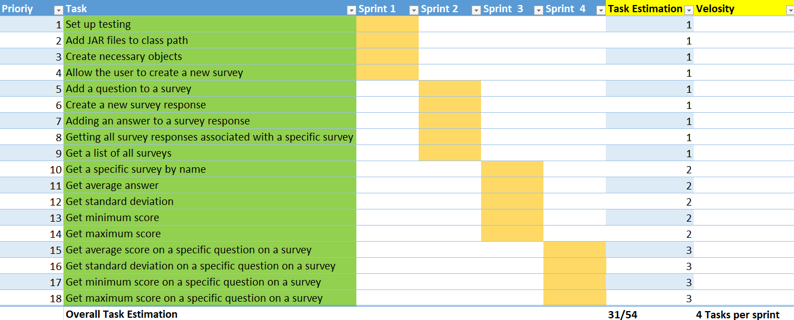
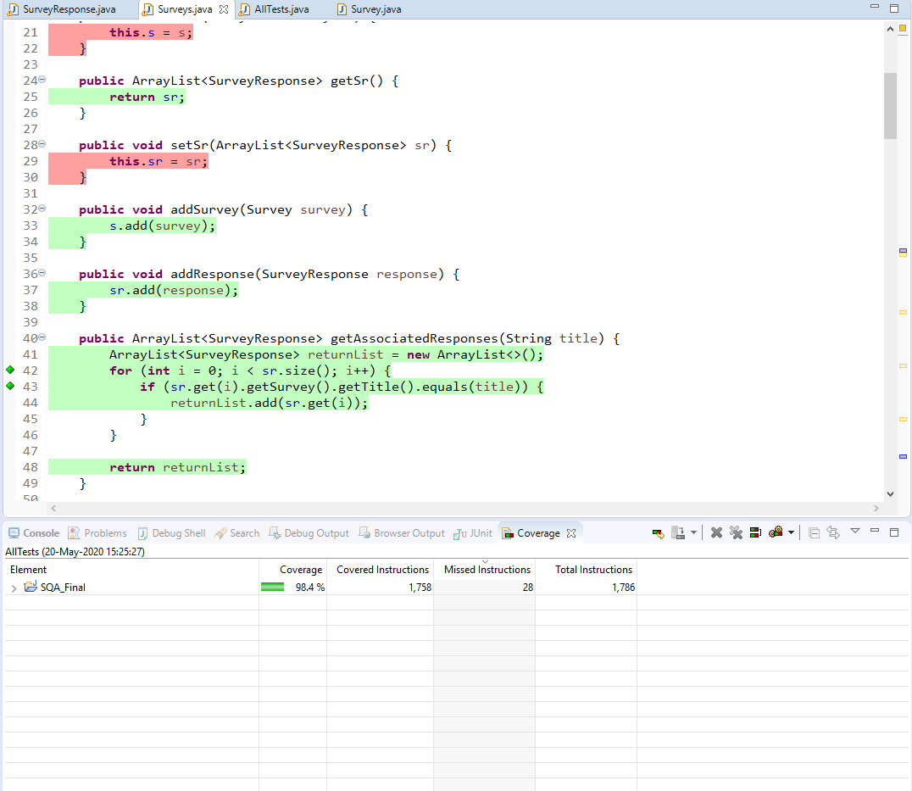
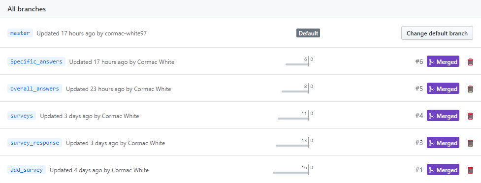
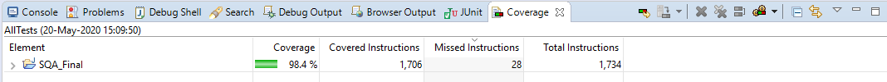
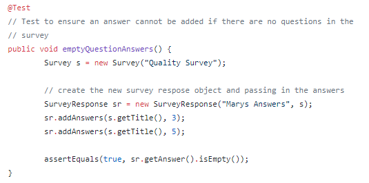
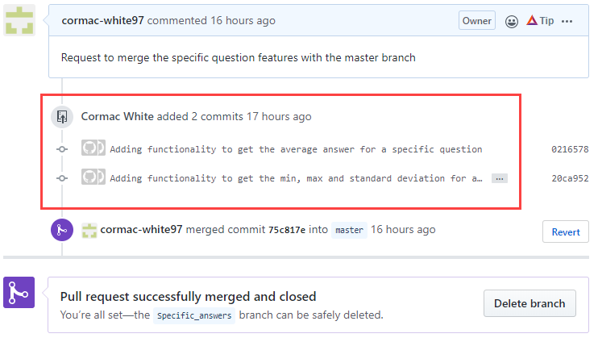

# Documentation

## Description:   
This code is a component that manages surveys and their answers. It provides a number of both functional and non-functional features that include the following:

-	Allow the user to create a new survey
-	Add a question to a survey
-	Get a list of all surveys
-	Get a specific survey by name
-	Create a new survey response
-	Adding an answer to a survey response
-	Getting all survey responses associated with a specific survey
-	Get average answer
-	Get standard deviation
-	Get minimum score
-	Get maximum score
-	Get average score on a specific question on a survey
-	Get standard deviation on a specific question on a survey
-	Get minimum score on a specific question on a survey
-	Get maximum score on a specific question on a survey

## Sprint Backlog:  
The sprint backlog provides a list of the tasks involved in this project, which are divided up into individual sprints, with each sprint being one day each. Each sprint column contains a set of orange cells, which indicate that the associated task is to be completed within that sprint. The task estimation provides an estimation of the effort required for each task, which is rated from 1 to 3, with 1 requireing the least amount of effort and 3 requireing the most. For this project, the overall task estimation is 31 out of a possible 54. The velocity was based on previous projects, and from those previous projects, I had determined that my velocity would be 4 tasks per day.

## Testing
In order to fully follow the idea of test driven development, I wrote each test before creating the method that it would use. This allowed me to decide on what I wanted returned from the method, and continue to make fixes to it in order to make it pass each test. Once I had each method tested, I added some error testing, for example, that an 11th question cannot be added to a survey. The test driven development I followed can be seen in my commit on the "Specific_answer"  branch in the commit with the ID, 60aeda8, where you can see the features being developed along with the appropriate unit tests.

An example of this is the test that was written for getting the minimum answer for a specific quesiton. In the test, I am adding two sets of survey reponses for the same survey, "Mary's answers", and "Joe's answers". I am then adding answers for both responses, and getting the minimum value for both questions in the survey. By testing two different questions, I am ensuring that the test is actually passing, and not just a possible coincidence.

## Test Coverage
For this project, I am using EclEmma, which is the built in test coverage tool that is included in Eclipse EE. It provides a percentage value for how much of the project's code is covered by the JUnit tests. As well as this, it also highlights the code that has been tested in green and the code that has not been tested in red. This helps to provide a clear image of what has been tested, and what needs to have tests written for it. 

## Version Control:
For this project, I had 6 separate branches, including the master branch. I divided up each feature in to a different branch, for example, there is a branch for all the features for all the overall surveys such as the average, standard deviation and the max and minimum score, and there is another branch for each of these features for a specific question in a survey. I chose to focus on one overall feature, and continuously pushed that that particular branch, and once that feature was complete, I would create a new pull request and begin to work on a new branch. The image below shows the branches that were used in this project's version control.

## Code Review:   
The following are a set of questions that will help developers perform a code review:

- **Has the feature been tested?**   
All new features must have an approprate number of JUnit tests. To ensure that all features are tested, the testing coverage tool in Eclipse EE must be run before the code is pushed. To ensure adequate testing, a minimum of 95% test coverage must be achieved. The image below shows the coverage tool in Eclipse EE being run.

- **Are the tests adequately commented?**   
All tests should have an overall comment explaining what is being tested, as well as other comments to explain what each step is doing. The following is an example of a well commented test.

- **Does the pull request have a description?:** 
When creating a pull request, the request must have a meaningful title, and the comments section must be used to describe what is being merged to the master branch. The image below shows a pull request that clearly explains what is being merged and where it is being merged to. It also shows commits with meaningful explanations about what is being pushed.

- **Is the feature complete?:** 
Any code that is being merged to the master branch must be fully completed and tested code. This will ensure that no risk that a partially completed feature will accidentally deployed.

- **Is the code clear?:** 
It is vital for the maintainability of any project that the code is easy to understand. A good test to check that code is clear is to have a developer who has not seen the code look at it and try to explain to you what the code is doing.

- **Is the code efficient?:** 
Is the code written in the most efficient way possible? Is there repeating code that could possibly be put into one method? Are there technologies that could help to improve the feature?

